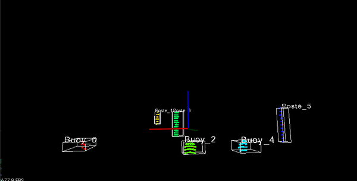

# Preprocessing Pkg
Pointloud preprocessing with ros. 

## Run
'''
  rosrun preprocessing preprocessing_node
'''

## Run Object Detection

  ### topics
  /velodyne_points[sensor_msgs::PointCloud2] = the input point cloud
  
  /obj_detected_list[preprocessing::obj_detected_list] = output detection 
  
  ### run
  roslaunch preprocessing demo.launch 
  
  
  
  

