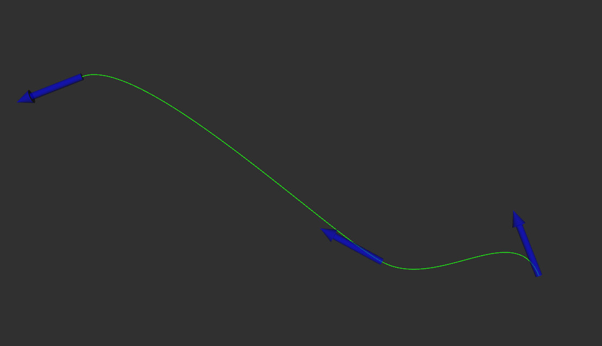

# USV Control

This package contains all the functioning code necessary for the USV to complete its control objectives. 

--------------------------

### Requirements

The overall control scheme is designed to receive the following information from other packages:

- Consistent and accurate USV localization information (as a standard, using a local NED reference frame)
- Obstacle list with position information
- Target waypoint(s) as defined by the current task

### Objectives

The goals for the control systems implemented are:

- Accurate waypoint completion, utilizing efficient thruster control
- Trajectory generation and tracking between multiple goal waypoints
- Trajectory correction for obstacle avoidance 
- Robust behavior while facing variable conditions

## Overall composition

### 1. Waypoint handler node

<div align="center">
    
</div>

This node is responsible for receiving and organizing the incoming goals list. Using bezier curves, it constructs a smooth path between the target positions that the USV can follow. Target positions include x and y coordinates, as well as yaw rotation. This node assumes the USV moves in the direction in which it is pointing, and plans for rotation in order to move in a specific direction. It is also responsible for selecting the next point along the path, according to a specific lookahead distance, drawing a straight line path to this point. This node is designed to take specific mission id's in order to tune the desired behavior of the boat. Pose information is also expected to determine waypoint arrival and path following. **This node does not implement obstacle avoidance.**

The inputs of this node are expected in the following topics:

```
/usv/goals [usv_interfaces/msg/WaypointList]
/usv/mission/id [std_msgs/msg/Int8]
/usv/state/pose [geometry_msgs/msg/Pose2D]
```

And the outputs are:

```
/usv/current_path_ref [nav_msgs/msg/Path] # Path to the lookahead distance point
/usv/path_to_follow [nav_msgs/msg/Path] # Full path to follow
/usv/wp_arrived [std_msgs/msg/Bool] 
/goals_markers [visualization_msgs/msg/MarkerArray]
```

All topics are under the frame id: "world"

### 2. Obstacle avoidance node (a_star_avoidance_node)

Whenever obstacle avoidance is necessary while plotting a path, the obstacle avoidance node can be used to fulfill the role of the waypoint handler node with this added feature. To do this, it subscribes to an additional topic, specifying obstacle coverage.

The inputs of this node are expected in the following topics:

```
/usv/goals [usv_interfaces/msg/WaypointList]
/usv/state/pose [geometry_msgs/msg/Pose2D]
/usv/obstacle_margins_map [nav_msgs/msg/GridCells]
```

And the output is:

```
/usv/path_to_follow [nav_msgs/msg/Path]
```

Note: this A* implementation is primitive and is not well prepared to handle unexpected obstacles, for better obstacle avoidance with current code, model predictive control (MPC) should be used.

### 3. Line of sight (LOS) node

The line of sight node is capable of producing a desired velocity and heading when given a path to follow in the form of a spline. Using the spline params, it is capable of finding a look ahead point, find cross-track and along-track errors, and deduce the velocity and heading that are ideal to move towards the stated position. These values should then be interpreted by a low-level controller. It also has some preset coefficients (max_vel and k_cte) that define how the desired heading and velocities are calculated.

The inputs this node expects are:

```
/usv/state/odom [nav_msgs/msg/Odometry]
/mpc/spline_params [std_msgs/msg/Float64MultiArray]
/mpc/spline_t [std_msgs/msg/Float64]
/mpc/spline_t_la [std_msgs/msg/Float64]
```

The outputs it produces are:

```
/guidance/desired_heading [std_msgs/msg/Float64]
/guidance/desired_velocity [std_msgs/msg/Float64]
/usv/current_path_ref [nav_msgs/msg/Path]
```


### 4. Low level control (PID, ASMC, AITSMC)

To actually get the boat to move in the planned ways, low level control is necessary. In this package, there are multiple controllers suited for this task. This includes a PID node, an adaptive sliding mode control node, and an adaptive integral terminal sliding mode control node. All of these fulfill the same function of converting a current state and a desired state and computing the necessary thrust to reach the desired state. 

These nodes generally expect the following inputs:

```
/setpoint/heading [std_msgs/msg/Float64]
/setpoint/velocity [std_msgs/msg/Float64]
/usv/state/pose [geometry_msgs/msg/Pose2D]
/usv/state/velocity [geometry_msgs/msg/Vector3]
```
Note: these topic names are often remapped in launch files (Ex: /setpoint/heading -> /guidance/desired_heading).

These nodes generally create the following output topics:

```
/usv/left_thruster [std_msgs/msg/Float64]
/usv/right_thruster [std_msgs/msg/Float64]
```


## Model simulation

Documentation pending

## Model Predictive Control

Documentation pending